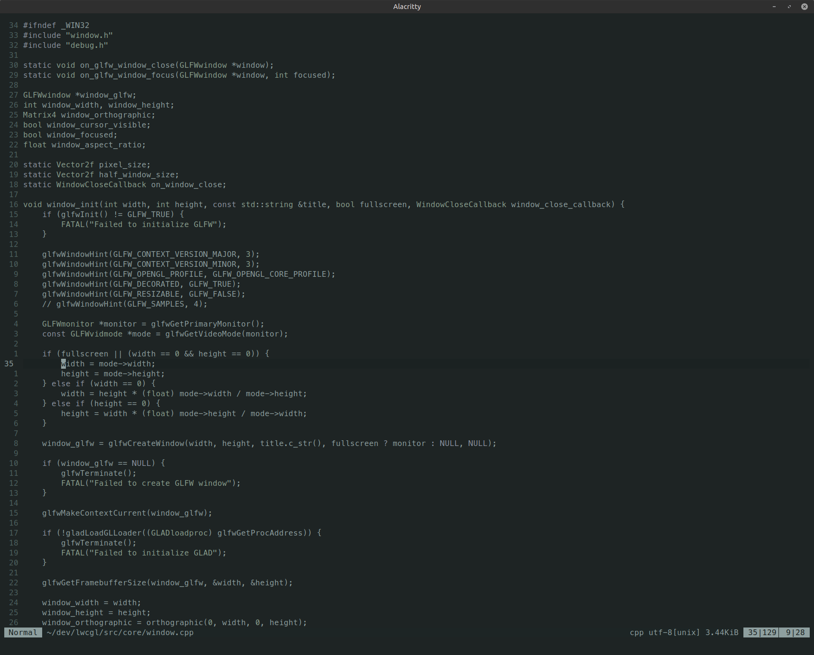

# Elysium.nvim

A dark minimalist Neovim colorscheme.



## Installation

### Using `vim.pack`

```lua
vim.pack.add({
    "https://github.com/TheTyl/elysium.nvim"
})

vim.cmd.colorscheme("elysium")
```

### Using `lazy.nvim`

```lua
{
    "TheTyl/elysium.nvim",
    lazy = false,
    priority = 1000,
    config = function()
        vim.cmd.colorscheme("elysium")
    end
}
```

## Usage

Inside `init.lua`

```lua
vim.cmd.colorscheme("elysium")
```
